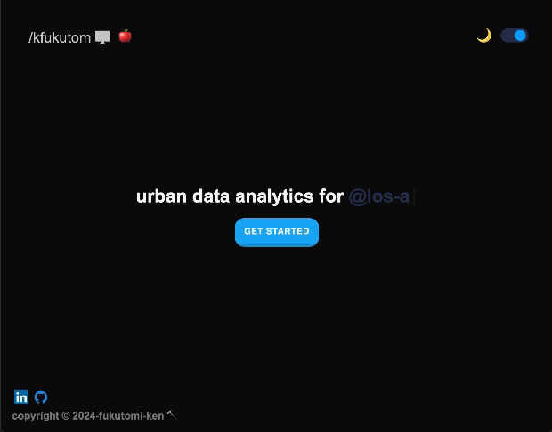
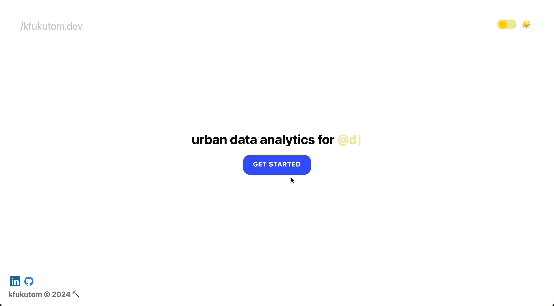
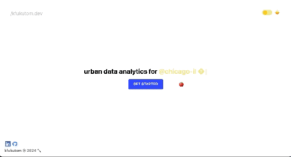
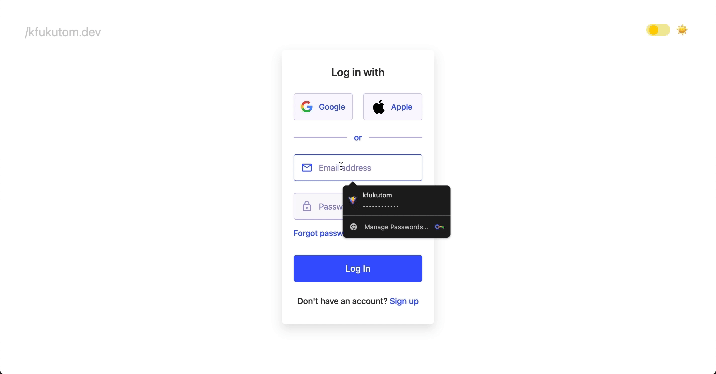

# Orientation & Onboarding

This project is my journey in learning software development fundamentals whilst applying computational social science programming tools! Some key goals of this project include:

- Establishing a clear **Design Hierarchy** for intuitive navigation
- Enhancing **User Interface (UI) Experience** for seamless interaction
- Deploying a productive **Agent-Based Model** to simulate a New York City borough environment
- Blend passion for products that connect tangible and intangible, digital spaces.
- Learn **D3.js**, along with implementing a MaplyAPI powered map.
- Master **React/React Native/CSS Styling** and become proficient in front-end development.

Project Premise ~
I wanted to work on a product that defines `urban tech` for myself. Using agent-based modeling and advanced spatial analytics with Python's NetworkX and OSMnx libraries, our platform evaluates key factors—like local infrastructure, economic conditions, and demographic data—to generate a unique livelihood score for each area. Users can input financial details to estimate potential returns, helping them make data-driven decisions for successful business ventures in the right neighborhoods. And for the sake of the scope of the project, I'm narrowing it down to the attributes of Manhattan/New York City in their respective boroughs.

Also, contributions are welcome! If you'd like to help improve this project, comment on any issues, feel free to open a pull request or reach out.\

---

## Progress Updates

**Date**: 10/29/24

As of **October 29, 2024**, I have successfully developed a simple and minimalistic landing page to welcome users to the project. In the coming months, I plan to integrate a robust relational database using either **SQLAce** or **Firebase Auth** to enhance the program's data handling capabilities. I'm super excited to integrate my agent-based modeling script with some attachment to network-adjacent Networkx metrics to learn about how my agents possibly could be handled better in a `simulated` environment!! I'm super new to all of this so I'm excited to get right in to the process. (Production Time: 5.5hrs)

 

**Date** 10/30+31/24 ~ While preparing for my Discrete Math exam, I discovered a solution to improve the light-toggle functionality. Gained valuable insights into React's DOM client handling. About to start work on the log-in portal for the free demo 💪 As of now, I'm planning on doing a simple login interface, utilizing NextAuth, Prisma, MongoDB, and for the front-end, I'll be using some neat TaildwindCSS to try that out! (Production Time: 5hrs)

**Date** 11/03/24 ~ Scrap the concept of using NextAuth, Prisma, MongoDB; instead, let's work with a Firebase Backend. I believe it's good for our current, potential size of a required database, and it fits some of the criteria to develop a smooth log-in authentication interface. So far, as of today, I was able to set up the interface for the log-in form. It was nice to get back to work, following some exams, but much of this was developed with simple React/Google-Fonts Tools/ and CSS/HTML styling tools. (Production Time: 3.5hrs)

**Date** 11/06/24 ~ Applied React Native, finished up the rendering for the loading screen animation.

**Date** 11/28/24 ~ Back on break, began working on applying the MapBoxAPI as well as implementing a slider for the website that will help users to navigate NYC seamlessly. Additionally, fixed up the application of the light/dark mode component for the map so it reflect's the importance of abiding user preferences prior to my own design decision-making.

