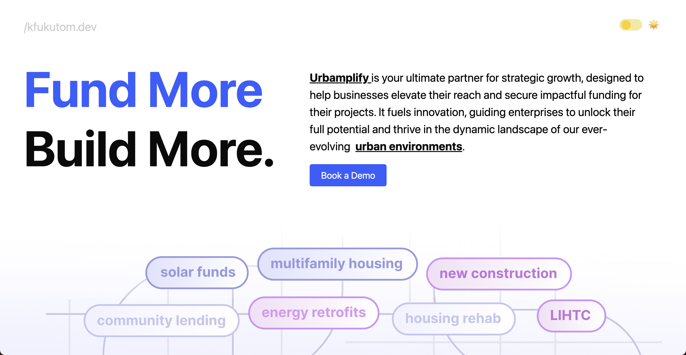

Demo:


This project is my journey in learning software development fundamentals whilst applying computational social science programming tools! Some key goals of this project include:

- Establishing a clear **Design Hierarchy** for intuitive navigation
- Enhancing **User Interface (UI) Experience** for seamless interaction
- Deploying a productive **Agent-Based Model** to simulate a New York City borough environment
- Blend passion for products that connect tangible and intangible, digital spaces.
- Learn **D3.js**, along with implementing a MaplyAPI powered map.
- Master **React/React Native/CSS Styling** and become proficient in front-end development.

Project Premise ~
I wanted to work on a product that defines `urban tech` for myself. Using agent-based modeling and advanced spatial analytics with Python's NetworkX and OSMnx libraries, our platform evaluates key factors—like local infrastructure, economic conditions, and demographic data—to generate a unique livelihood score for each area. Users can input financial details to estimate potential returns, helping them make data-driven decisions for successful business ventures in the right neighborhoods. And for the sake of the scope of the project, I'm narrowing it down to the attributes of Manhattan/New York City in their respective boroughs.

Also, contributions are welcome. If you'd like to help improve this project, comment on any issues, feel free to open a pull request or reach out: kfukutom@umich.edu

To set up and run this project on your local device, follow these steps:

Ensure you have the following installed on your system:
- [Node.js](https://nodejs.org/) (latest LTS version recommended)
- npm (comes with Node.js)

### Installation

1. Clone the repository to your local machine:
   ```bash
   git clone https://github.com/kfukutom/urbamplify
   cd urbamplify
   npm install
   npm run dev
   ```
That is all!
